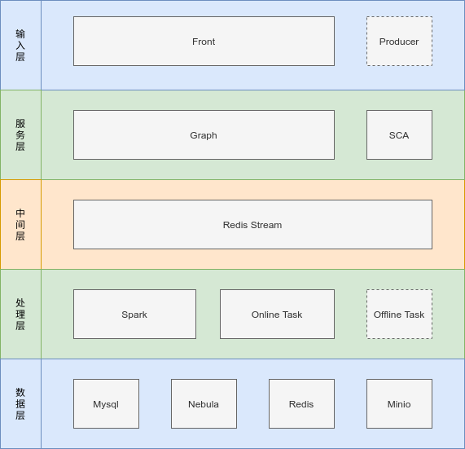
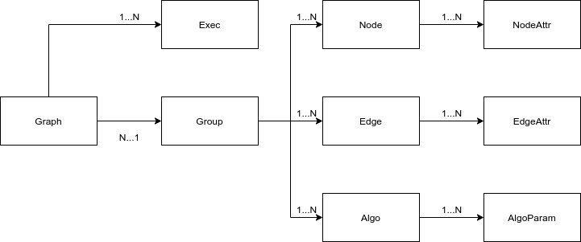

# 开发手册

`Chainsawman` 是一个知识图谱的构建与可视化方案，支持自定义图谱类型、上传图谱数据、图谱在线可视化及查询、大规模图算法。

此外，`Chainsawman` 基于网络分析方法，对包含` Python、Java、Go、Rust`在内的开源软件研究提供了内置支持，具体提供了：版本级开源软件依赖图谱、卡脖子软件识别图谱、软件成分分析、软件静态检查、5种开源软件影响力评估算法。

## 1. 系统架构



系统包含输入层、服务层、中间层、处理层和数据层。

其中，输入层包含：

1. `Front`：WEB前端，通过在线交互以支持图谱管理及可视化、图算法的功能 
2. `Producer`：流式生产并写入图数据

服务层包含：

1. `Graph`：图谱服务，负责处理来自前端的图谱相关请求
2. `SCA`：软件分析服务，负责处理开源软件相关分析请求

中间层包含：

1. `Redis Stream`：提供一个任务队列，以隔离高耗时、耗能请求，并对其做异步分发、限流处理。

处理层包含：

1. `Spark`：基于Spark Graphx构建的图谱计算框架，用于执行提供的图计算算法。
2. `Online Task`：消费`Redis Stream`，执行图谱构建、数据写入、图谱查询等任务。
3. `Offline Task`：消费`Redis Stream`，执行来自`Producer`的流式图数据写入任务。

数据层包含：

1. `Mysql`：存储现存图谱的相关元数据，如图谱结构。存储算法元数据。存储任务执行状态及结果。
2. `Nebula`：图数据库集群，存储图谱的实际数据。
3. `Redis`：可用缓存。
4. `Minio`：文件存储，存储图谱原始数据文件，算法执行Jar包、算法描述Markdown中引用附件等。

## 2. 部署方案

### 2.1 docker-compose（推荐）

1. `cd dockerfiles`
2. `docker-compose up`

### 2.2 k8s

在`K8S`目录下提供了各服务对应的基础K8S文件。**不保障可运行！**

### 2.3 手动部署

1. 依赖准备
   1. 参考`graph/cmd/api/etc/graph.yaml`配置`Nebula`，`Mysql`，`Redis`，`Minio`，`Livy`
   2. 将`dockerfiles/spark/jar/common-latest.jar`加入`Spark`的`jars`目录，删除`jars/okhttp-3.12.12.jar jars/okio-1.14.0.jar`
2. 数据准备
   1. 在`Mysql`中执行 `graph/scripts/graph.sql`的建表SQL，执行`graph/scripts/gsql/*.sql`的数据SQL
   2. 执行`dockerfiles/minio/mc/init.sh`以上传`dockerfiles/minio/jar/*.jar`的算法文件和`dockerfiles/minio/assets/*`的附件文件。注意安装`mc`且修改脚本中对应的`minio`域名。
3. 启动服务
   1. 执行`go run graph/cmd/api/graph.go`以启动`Graph`
   2. 执行`go run consumer/task/main.go `以启动`Task`
   3. 执行`python sca/main.py`以启动`SCA`
   4. 执行`cd front`，`npm run install`，`npm run dev`以启动`Front`


## 3. 数据层

### 3.1 Mysql

表结构SQL见`graph/scripts/graph.sql`

* 一个`Group`通过一组`Edge`和`Node`定义了一套图谱结构，并有一系列`Algo`适用于该类型的图谱
* 一个`Group`下可能存在多个`Graph`
* 一个`Graph`可以有执行多个图算法`Exec`

共有以下表格：

| Graph     | 图谱元数据       |
| --------- | ---------------- |
| Group     | 图谱结构定义     |
| Edge      | 边定义           |
| Node      | 节点定义         |
| EdgeAttr  | 边属性定义       |
| NodeAttr  | 节点属性定义     |
| Algo      | 算法元数据       |
| AlgoParam | 算法入参定义     |
| Exec      | 存放算法执行结果 |



### 3.2 Nebula

对于一个`ID`为`X`的图，首先需要查询`Mysql`中定义的图结构，并在`Nebula`中创建一个`Space`——`GX`。在这个`Space`中，会将图结构中的`Node`和`Edge`映射为`Tag`和`Edge`，并针对`NodeAttr`和`EdgeAttr`中的主要属性`Primary`建立索引。

### 3.3 Minio

在`Minio`中共有5种目录：

* source，临时存放用户上传的图谱数据原始文件，保存期1天
* assets，永久存放算法描述文件中的附件
* lib，永久存放算法的JAR包
* algo，永久存放算法的执行结果文件
* tmp，临时存放`Spark`计算过程中产生的`checkpoint`

## 4. 输入层

### 4.1 Front

`Front`采用`UMI`框架编写，参见：[UMI](https://umijs.org/)

`Front`的开发流程主要为：

1. 执行`npm run openapi`以从`graph.json`或更多`swagger`接口定义文件中读取信息，更新后端接口。针对新的接口，可在`mock`目录下编写mock
2. 在`.umirc.ts`中更新新页面的路由信息
3. 在`pages`中编写新的页面

代码目录：`front`

```shell
front
├── graph.json					graph的swagger接口定义文件
├── mock						mock目录
├── package.json				
├── .umirc.ts					前端配置文件，包含路由信息，其中proxy字段用于本地开发，mock字段用于启用mock测试
├── src
│   ├── app.tsx					前端入口函数
│   ├── assets					前端静态资源
│   ├── components				组件目录
│   ├── constants				常量目录
│   ├── models					前端状态管理
│   ├── pages					页面目录
│   ├── services				后端接口目录，基于swagger文件生成
│   └── utils					工具目录
```


### 4.2 Producer

TODO

## 5. 服务层

### 5.1 Graph

`Graph`从`Front`接受请求，依据请求类型，共存在三种处理方式：

* 直接处理返回
* 将高耗时请求包装为任务写入`Redis Stream`交由`Task`处理
* 将图计算请求提供`livy`交付`spark`集群处理

`Graph`采用`go-zero`框架编写，参见：[GO-ZERO](https://go-zero.dev/docs/concepts/overview)。

`Graph`的开发流程主要为：

1. 编写`graph/cmd/api/graph.api`以增加新的接口
2. 编写并运行`graph/scripts/graph.sql	`以支持新的数据库表格
3. 在`gjson`中定义新的图谱结构
4. 运行`graph/scripts/gen_api.sh`以更新框架代码（同时更新`Graph`和`On-line Task`）
5. 在`graph/cmd/api/internal/logic`下新生成的文件中编写请求的处理逻辑

代码目录：`graph`

```shell
graph/
├── cmd											服务端处理逻辑
│   └── api											HTTP请求处理逻辑
│       ├── etc											存放配置文件
│       │   ├── graph-pre.yaml								docker/k8s	
│       │   └── graph.yaml									手动部署
│       ├── graph.api									HTTP API文件，定义了所有请求API，请求和返回类型
│       ├── graph.go									main函数，服务端入口函数
│       ├── graph.json									swagger文件，基于HTTP API文件生成，辅助前端了解后端提供的接口
│       └── internal									具体逻辑（私有）
│           ├── config										存放配置
│           │   ├── config.go									初始化所有依赖的客户端
│           │   └── errors.go									定义错误类型
│           ├── etc										
│           ├── handler										处理HTTP请求，解析请求值并定位处理函数
│           ├── logic										请求的具体处理函数（需要编写）	
│           ├── svc										将初始化后的客户端注入请求上下文
│           ├── types									依据HTTP API文件生成请求和返回对应的类
│           │   └── types.go
│           └── util									
├── db												数据库交互逻辑
│   ├── query											gorm gen生成代码
│   ├── ...go											
├── kvTask.proto									Redis Stream队列中消息的定义格式
├── model											数据库模型类，包含gorm gen生成代码
├── rpc												RPC交互逻辑
├── mq												消息队列交互逻辑
└── scripts											存放脚本文件
    ├── gen_api.sh										依据HTTP API文件生成框架代码、swagger文件；调用gen.go，gen_sql.go。
    ├── gen.go											生成gorm gen代码
    ├── gen_sql.go										依据gjson中定义的图谱结构生成数据SQL
    ├── gen_template.go									依据gjson中定义的图谱结构生成算法模板Template.scala
    ├── gjson											一系列JSON文件，对预支持的图谱的结构以及适用的算法进行定义
    │   └── ...json
    ├── graph.sql										Mysql表结构SQL
    └── gsql											存放gen_sql.go生成的数据SQL文件
        └── ...sql
```

### 5.2 SCA

`SCA`从`Front`接受请求，采用`Flask`框架编写。

`SCA`的开发流程主要为：

1. 在`main.py`中编写新的接口
2. 在`vo`中定义接口对应的请求和返回值类型
3. 在`service`中开发新的代码处理该请求
4. 在`common/lang.py`添加新的语言的基本信息，并在`util/deps`和`util/lint`中添加对应实现

代码目录：`sca`

```shell
sca/
├── client										初始化所有依赖的客户端 
├── common										通用处理逻辑
│   ├── http.py										定义HTTP返回
│   ├── lang.py										定义各种语言的基本信息
├── config										存放配置文件
│   ├── client.json									手动部署
│   ├── client-pre.json								docker/k8s	
│   ├── pmd_mvn_ruleset.xml							maven采用的PMD规则
│   └── pmd_ruleset.xml								PMD规则全集
├── lib											存放第三方库
│   └── libmod.so									解析GO依赖
├── main.py										main函数，服务端入口函数
├── service										请求的具体处理函数（需要编写）	
├── test										存放测试文件
├── util										工具类库
│   ├── deps										解析各语言依赖
│   ├── file_helper.py								处理压缩文件
│   ├── http.py										发送HTTP请求
│   ├── lint										对各语言代码进行静态检查
│   ├── minio_helper.py								与Minio交互
│   ├── pom_helper.py								处理POM文件
│   ├── requirements_detector						解析Python依赖
│   ├── singleton.py								单例模式注解
│   └── vul_api.py									与VULDB交互
└── vo											定义各请求的输入输出类型
```


## 6. 中间层

### 6.1 Redis Stream

#### 6.1.1 消息格式

采用`Protobuf`将任务序列化为以下消息格式。任务类型使用`IDF`进行标识，任务使用`ID`编号。消费者在获得任务后依据`IDF`选择处理逻辑，并读取参数`params`和`graphID`从对应的图谱中获得需要的数据，最终依据`ID`将任务状态`status`和任务结果`result`写入`Mysql`。

```protobuf
syntax = "proto3";
package model;
option go_package = "graph/model";

message KVTask {
  string id = 1;
  Status status = 2;
  string params = 3;
  string result = 4;
  int64 graphID = 5;
  string idf = 6;

  enum Status{
    New = 0;
    Finished = 1;
    Err = 2;
  }
}
```

#### 6.1.2 消息队列

采用客户端`github.com/hibiken/asynq`操作`Redis`充当消息队列。

该库将不同类型任务划分处理优先级，其中查询相关请求为高优先级，图谱创建更新请求为低优先级。

以下代码涉及任务发收逻辑：

* `graph/cmd/api/internal/util/task.go`
* `graph/mq/task_impl_v2.go`
* `consumer/task/main.go`
* `common/task.go`

有`consumer/asynqmon`作为可选部署项目，可用于监控消息队列状态。[asynqmon](https://github.com/hibiken/asynqmon)。

## 7. 处理层

### 7.1 Spark

`Spark`中算法具体表现为 `JAR`包形式，算法的执行过程为：`Graph`将算法`JAR`包路径及其他必要参数（如算法执行对象图谱的ID）告知`livy`，并由`livy`向`Spark`集群提交该任务。因此，编写图算法即在被提交的`JAR`包中编写处理逻辑，通常包含三个步骤：1. 输入：解析参数、从`Nebula`中读取图谱数据；2. 处理；3. 输出：将处理结果输出到`Minio`或`Mysql`。

#### 7.1.1 Common 

代码目录：`algo/common`

```shell
applerodite/
├── config
│   └── CommonService.scala
├── dao
│   ├── GraphClient.scala
│   ├── MinioClientImpl.scala
│   ├── MysqlClientImpl.scala
│   ├── MysqlClient.scala
│   ├── NebulaClientImpl.scala
│   └── OSSClient.scala
├── model
│   └── AlgoTaskPO.scala
└── util
    └── CSVUtil.scala
```

`Common`包为编写具体的算法提供了一些通用的方法，例如读写`Mysql`，`Minio`及`Nebula`。

#### 7.1.2 Algo

代码目录：`algo/*`

```shell
algo/integrated/
├── pom.xml
├── src
│   └── main
│       └── scala
│           └── applerodite
│               └── integrated
│                   ├── Main.scala
│                   └── Template.scala
```

以算法`integrated`为例，算法通常包含两个代码文件，`Main.scala`和`Template.scala`。其中`Template.scala`定义了算法的输入输出的数据结构，并预定义了算法处理的图谱类型中所具备的节点及边的元信息`GraphView`，此外还规定了算法的执行逻辑：`input->exec->output`。

```scala
abstract class Template {
  // 输入处理逻辑
  def input(args: Array[String]): Param = {
    val json = JSON.parseObject(args.apply(0))
    val graphID: String = json.getString("graphID")
    val target: String = json.getString("target")
	val _libraries = json.getJSONArray("libraries")
	val `libraries` = Seq.empty
    for (i <- 0 until _libraries.size()) {
      `libraries` :+ _libraries.getString(i)
    }
	Param(libraries = libraries, graphID = graphID, target = target)
  }

  /*
    编写算法需要重载逻辑
    svc: common 包中提供的服务，包含对 spark，minio，mysql，nebula 的访问
    param: 算法输入
   */
  def exec(svc: CommonService, param: Param): Seq[Row]

  // 输出处理逻辑
  def output(svc: CommonService, param: Param, rows: Seq[Row]): Unit = {
    val spark = svc.getSparkSession
    val df = spark.sqlContext.createDataFrame(spark.sparkContext.parallelize(rows), Constants.SCHEMA)
    svc.getOSSClient.upload(name = param.target, content = CSVUtil.df2CSV(df))
    svc.getMysqlClient.updateStatusByOutput(param.target)
  }

  // 默认的算法执行流程，即 Input -> Exec -> Output
  def main(args: Array[String]): Unit = {
    if (args.length < 1) {
      return
    }
    val svc = CommonServiceImpl
    val param = input(args)
    val res = exec(svc, param)
    output(svc, param, res)
    // TODO: 异常处理，defer 关闭 spark
    svc.getSparkSession.stop()
  }
}
```

在`Main.scala`中，开发者需要继承`Template`类，并根据需求重写其中`input`，`exec`，`output`或者`main`函数（`Spark`默认执行`JAR`包中的`Main.main()`）。其中对于`exec`的重写是必要的。在简单的`degree`算法中，`Main.scala`编写如下。

```scala
object Main extends Template {
  override def exec(svc: CommonService, param: Param): Seq[Row] = {
    val graph: Graph[None.type, Double] = svc.getGraphClient.loadInitGraph(param.graphID, hasWeight = false)
    graph.degrees.map(r => ResultRow(`id` = r._1, `score` = r._2)).sortBy(r => -r.`score`).map(r => r.toRow()).collect()
  }
}
```

如何生成`Template.scala`？

运行脚本`graph/scripts/gen_template.go`。该脚本会解析`JSON`定义的图结构文件，并从中读取对于特定图结构应当支持的图算法，并根据定义的图算法的元信息以及其所依赖的图谱的元信息生成`Template.scala`。

一个简单的使用是：`go run graph/scripts/gen_template.go -g graph/scripts/gjson -a degree -o algo/degree/src/main/scala/applerodite/degree ` ，该命令从`gjson`目录下读取所需的图结构文件，并对图算法`degree`生成`Template.scala`。

总而言之，编写新的算法的主要流程如下：

1. 在`gjson`中定义的适用该算法的图谱结构中定义该算法的基本信息，如算法名称、输入、输出
2. 执行`graph/scripts/gen_template.go`以获得算法对应的`Template.scala`
3. （在`algo`目录下）创建新的算法目录，编写`Main.scala`继承`Template.scala`并实现算法逻辑
4. 使用`maven`打包该算法
5. 将该算法的`Jar`包上传至`minio`中。`dockerfiles/minio/mc/init.sh`会在`docker`部署时，自动将`dockerfiles/minio/jar`下的`Jar`包上传至`minio`。因此，可以采用`dockerfiles/minio/fetch_jars.sh`自动将`algo`目录下编写的算法的`Jar`复制至`dockerfiles/minio/jar`。

### 7.2 On-line Task

`On-line Task`从`Redis Stream`中读取`Task`，并交付对应的`handler`处理，最终将结果写入数据库。

`On-line Task`目前只处理4种任务，定义在`common/task.go`中：

* 图谱创建`graph:create`
* 图谱更新`graph:update`
* 图谱查询`graph:get`
* 图谱节点子查询`graph:neighbors`

`On-line Task`的开发流程主要为：

1. 在`common/task.go`定义新的任务类型
2. 在`handler`目录下实现任务对应的处理逻辑
3. 在`main.go`中将该任务类型对应到`handler`下编写的处理逻辑

代码目录：`consumer/task`

```shell
consumer/task/
├── config						管理服务配置及常量
├── db							实现数据库方法
├── etc							存放配置文件
│   ├── consumer-docker.yaml		docker部署
│   ├── consumer-pre.yaml			k8s部署
│   └── consumer.yaml				本地部署
├── handler						针对不同任务的具体处理逻辑
├── main.go						消费者，不断从Redis Stream读取任务，处理后写入任务结果
├── model						数据库的模型类
├── mq							读写Redis Stream的具体实现
├── scripts						存放脚本
│   └── gen.go						用于生成数据库查询所需的模板代码
└── types						
    └── types.go				复制自graph/cmd/api/internal/types/types.go，用于将任务结果序列化为graph应有的返回值
```

### 7.3 Off-line Task

TODO