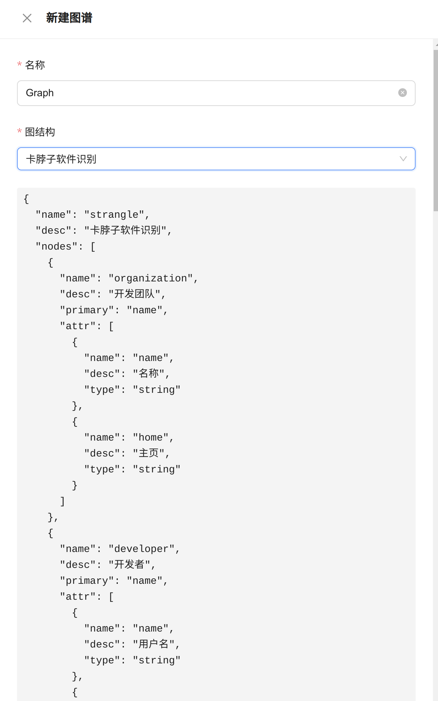

# 用户手册

`Chainsawman` 是一个知识图谱的构建与可视化方案，支持自定义图谱类型、上传图谱数据、图谱在线可视化及查询、大规模图算法。

此外，`Chainsawman` 基于网络分析方法，对包含` Python、Java、Go、Rust`在内的开源软件研究提供了内置支持，具体提供了：版本级开源软件依赖图谱、卡脖子软件识别图谱、软件成分分析、软件静态检查、5种开源软件影响力评估算法。

## 1. 主页

展示系统中存储的图谱总数、节点总数及边总数。

随机显示`breadth`，`depth`，`mediation`，`stability`，`integrated`，`hhi`六种图算法的结果（需要系统中执行过这些算法）。

## 2. 自定义图谱类型
|     |     |
| ---- | ---- |
| 展示系统中定义的图谱结构 | 新建图谱结构，可定义图中持有的节点和边类型 |

## 3. 管理图谱数据

|  |  |
| ------------------------------------------------------------ | ---------------------------------------- |
| 展示系统中已有的图谱信息                                     | 选择一种图谱类型并新增该类型的图谱       |

## 4. 图算法

|                |                        |
| ---------------------------------------------- | ------------------------------------------------------ |
| 展示系统中录入的算法信息                       | 选择一张软件依赖图谱计算其中的软件影响力               |
|                |                        |
| 选择一张卡脖子分析图谱识别其中的潜在卡脖子软件 | 选择一张图谱，执行适用的一种算法。或查看历史算法结果。 |

## 5. 软件成分分析

## 6. 软件静态分析

上传源代码压缩包并完成静态检查。

